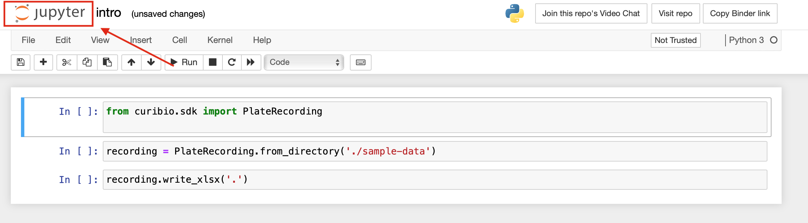

.. _gettingstarted:

Jupyter Notebooks
=================

Jupyter is the environment that CuriBio SDK is designed to be used in. It allows creation
of Python Notebooks which consist of Code Cells (also referred to as just 'cells') that contain Python code,
each of which can be executed independently of others.

Getting Started with Jupyter
----------------------------

Click |mybinder_link| to navigate to the online
notebook.

.. |mybinder_link| raw:: html

   <a href="https://mybinder.org/v2/gh/curibio/curibio.sdk/master?filepath=intro.ipynb" target="_blank">here</a>

You should land on a page that looks like this:

.. image:: images/mybinder_loading_page.png
    :width: 600

It may take a few minutes to load the notebook. Once it's loaded you should see this page:

.. image:: images/fresh_nb.png
    :width: 600

Each block of code is a code cell. When a code cell is running, you will see this to
the left of it:

When a cell completes execution, the star will become a number:

This number corresponds to the order the cells are run in. For this example,
there are only 3 cells and none will need to be re-run. If a cell is re-run,
the number will change.

Working With the SDK
====================

This section will demonstrate how to upload H5 files to Jupyter, convert them to
an excel sheet, and then download the converted files.

Uploading H5 Files
------------------

1. To begin uploading H5 files, click the Jupyter logo in the top left corner to
   navigate to the file explorer page:

You should now be on this page listing all the folders and files currently in the environment:

.. image:: images/fresh_files_page.png
    :width: 600

2. Click on ``my-data``. You should now be in the ``my-data`` folder:

3. Click on the upload button in the top right and select the files you wish to upload.
   You may see an upload button next to each file you selected to upload.
   If this happens, just click the new upload button next to each file to complete the process.

When the uploads complete, the page should look like this:

4. Click the folder icon shown below to go back to the main files page:

.. image:: images/folder_icon.png
    :width: 50

Exporting Data to an Excel File and Downloading
-----------------------------------------------

1. Navigate back to the notebook page by clicking on ``intro.ipynb``.

2. Before running any code cells, you will need to update the file location.
   Change the line::

      recording = PlateRecording.from_directory('./sample-data')

   to::

      recording = PlateRecording.from_directory('./my-data')

3. You can now begin running the code. To do so, click ``Cell`` near the top left, then click ``Run All``:

If there are many files, it may take a minute or two to convert all of them.
Progress messages will be printed to indicate the code is working and not frozen.
When all cells complete execution there should be a number next to every cell.
You will also see a message printed underneath the last cell indicating that
writing to the ``.xlsx`` file is complete:

4. Click on the Jupyter Logo in the top left of the page again to
go back to the files page. You should should now see a new ``.xlsx`` file. The
name of the file should contain the barcode of the plate the data was recorded from.

5. To download, check the box to the left of the file and then press ``download``
near the top left.

.. image:: images/download_screen.png
    :width: 600