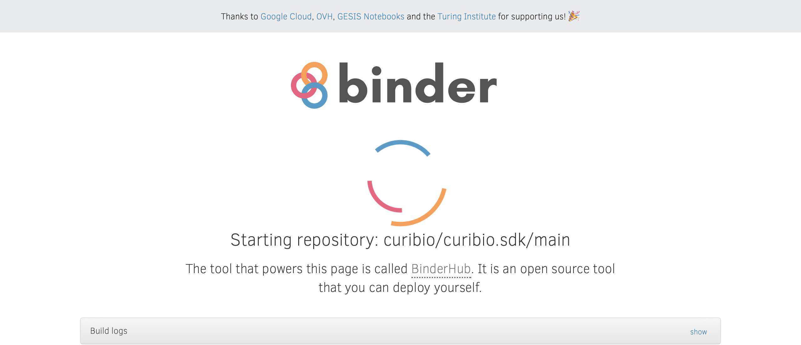
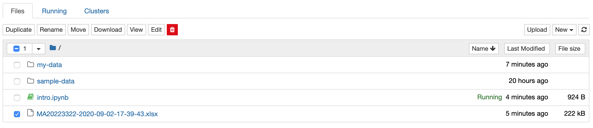

.. _gettingstarted:

Jupyter Notebooks
=================

Jupyter is the environment that CuriBio SDK is designed to be used in. It allows creation
of Python Notebooks which consist of Code Cells (also referred to as just 'cells') that contain Python code,
each of which can be executed independently of others.

Getting Started with Jupyter
----------------------------

Click |mybinder_link| to navigate to the online
notebook.

.. |mybinder_link| raw:: html

   <a href="https://mybinder.org/v2/gh/curibio/curibio.sdk/master?filepath=intro.ipynb" target="_blank">here</a>

You should land on a page that looks like this:

It may take a few minutes to load the notebook. Once it's loaded you should see this page:

Each block of code is a code cell. When a code cell is running, you will see this to
the left of it:

.. image:: images/running_cell.png
    :width: 100

When a cell completes execution, the star will become a number:

.. image:: images/finished_cell.png
    :width: 100

This number corresponds to the order the cells are run in. For this example,
there are only 3 cells and none will need to be re-run. If a cell is re-run,
the number will change.

Working With the SDK
====================

This section will demonstrate how to upload H5 files to Jupyter, convert them to
an excel sheet, and then download the converted files.

Uploading H5 files
------------------

To begin uploading H5 files, click the Jupyter logo in the top left corner:

.. image:: images/jupyter.png
    :width: 200

You should now be on a page listing all the folders and files currently in the environment:

Click on ``my-data``. You should now be in the ``my-data`` folder:

.. image:: images/my_data.png
    :width: 600

Click on the upload button in the top rightand select the files you with to upload.
When the upload completes, you should see the uploaded files now on the page.

Now click the folder icon shown below to go back to the main files page:

Exporting data to an excel file
-------------------------------

Navigate back to the notebook page by clicking on ``intro.ipynb``.

Before running any code cells, change the line::

    recording = PlateRecording.from_directory('./sample-data')

to::

    recording = PlateRecording.from_directory('./my-data')

You can now begin running the code. To do so, click ``Cell`` near the top left, then click ``Run All``:

.. image:: images/cell_run_all.png
    :width: 600

If there are many files, it may take a minute or two to convert all of them.
When all cells complete execution there should be a number next to every cell:

.. image:: images/finished_cells.png
    :width: 600

Click on the Jupyter Logo in the top left of the page again to
go back to the files page. You should should now see a new ``.xlsx`` file. The
name of the file should contain the date the data was recorded formatted ``yyyy-mm-dd``.

To download, check the box to the left of the file and then press ``download``
near the top left.

